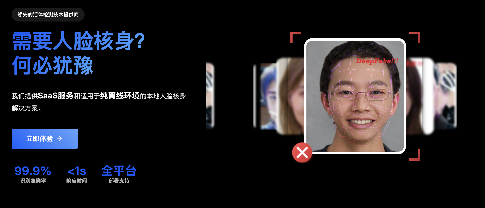
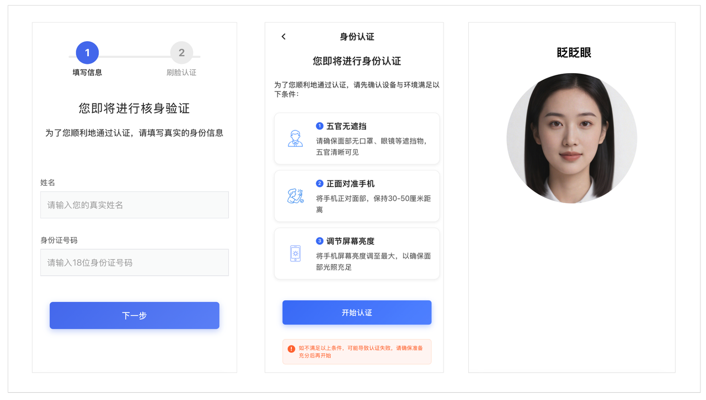

<div align="center" style="margin-top: 30px; margin-bottom: 30px;">
  
</div>

## 产品预览

<div align="center" style="margin: 20px 0;">
  
  <p style="margin-top: 10px; color: #666; font-size: 14px;">人脸核身产品效果图</p>
</div>

本项目基于 uni-app，集成了易顺达活体检测能力，并演示了两种认证流程：
- 活体检测（liveness）
- 实人认证（real：姓名+身份证号+刷脸）

## 目录结构
- `pages/index/index.vue` 首页，产品选择入口
- `pages/verify/index.vue` 统一认证页（根据 type 区分调用不同商品）
- `pages/real-auth/index.vue` 实人认证信息填写页（姓名+身份证号）
- `pages/result/index.vue` 结果页
- `uni_modules/eshunda-liveness` 易顺达活体 SDK 模块

## 运行与构建
1. 使用 HBuilderX 打开项目目录（建议版本 ≥ 3.1.0）
2. 从云市场导入插件到本项目（见下文“从云市场导入插件”）
3. 在项目根目录双击打开 `manifest.json`
4. 切换到“基础配置”页签，找到“应用标识（AppID）”
5. 制作自定义调试基座（必须，包含 UTS 插件）：
   - 在 HBuilderX 顶部菜单：运行 → 运行到手机或模拟器 → 制作自定义基座
   - 选择 Android 平台，勾选包含 UTS 插件/uni_modules
   - 生成完成后，将该基座安装到测试设备
6. 使用“运行到自定义基座”将项目运行到已安装的自定义基座
7. 首次运行建议真机调试，确保相机权限正常

提示：如未使用自定义基座，UTS 插件无法生效，可能导致活体 SDK 不可用。

## 必要配置
在 `pages/verify/index.vue` 中设置 APPCODE：
```ts
// pages/verify/index.vue
const APPCODE = '替换为你的appcode'
```
获取方式：
- 购买或试用云市场产品后，进入控制台（`https://marketnext.console.aliyun.com/bizlist`）查看 APPCODE。

## 页面路由
在 `pages.json` 已注册：
- `pages/index/index` 首页
- `pages/verify/index` 认证页
- `pages/result/index` 结果页
- `pages/real-auth/index` 实人认证信息页

首页跳转逻辑（已内置）：
- 活体检测：`/pages/verify/index?type=liveness`
- 实人认证：`/pages/real-auth/index` → 填写信息后跳 `verify` 并携带参数

## 实人认证接口
已按您的要求切换：
- 初始化获取 Token：`https://esdrp.market.alicloudapi.com/getToken`
- 认证核验：`https://esdrp.market.alicloudapi.com/verify`

请求格式均为 `application/x-www-form-urlencoded`，项目内的 `post` 方法已统一转码：
```ts
const post = (url: string, data: any) => new Promise((resolve, reject) => {
  const formData = Object.keys(data)
    .map(k => `${encodeURIComponent(k)}=${encodeURIComponent(data[k])}`)
    .join('&')
  uni.request({ url, method: 'POST', data: formData, header: {
    'Content-Type': 'application/x-www-form-urlencoded; charset=UTF-8',
    'Authorization': 'APPCODE ' + APPCODE,
    'X-Ca-Nonce': uuid()
  }, success: res => { /* ... */ }, fail: reject })
})
```

## 认证类型说明（verify 页面）
`/pages/verify/index.vue` 会根据 `type` 参数选择不同流程：
- `liveness`：活体检测
  - 获取 Token：`https://fake.market.alicloudapi.com/getToken`
  - 验证接口：`https://fake.market.alicloudapi.com/verify`
- `real`：实人认证
  - 获取 Token：`https://esdrp.market.alicloudapi.com/getToken`
  - 验证接口：`https://esdrp.market.alicloudapi.com/verify`

从 `real-auth` 页面会传递：
- `name`（姓名）
- `idNumber`（身份证号）

verify 页面会在初始化与核验接口中按需带上对应参数。

## 从云市场导入插件
请从 DCloud 插件市场导入易顺达活体检测插件：
- 插件地址：[`https://ext.dcloud.net.cn/plugin?id=24865`](https://ext.dcloud.net.cn/plugin?id=24865)

步骤：
1. 打开 HBuilderX（建议 3.1.0+ 版本）
2. 访问插件市场链接，点击“下载插件并导入 HBuilderX”
3. 在 HBuilderX 中选择当前项目导入，插件会以 `uni_modules/eshunda-liveness` 形式落地
4. App 端需制作自定义调试基座（含 UTS 插件），然后运行到 Android 设备
5. 在 `main.js` 或首页初始化位置调用：
   ```ts
   import { init } from '@/uni_modules/eshunda-liveness'
   init()
   ```
6. 在认证页使用：
   ```ts
   import { verifyInit, startLivingDetect } from '@/uni_modules/eshunda-liveness'
   const { code, data } = await verifyInit({ livingType: 2 })
   // 向服务端换取 token 后
   const ret = await startLivingDetect(token)
   ```

注意：
- 该插件为端云结合方案，需配合服务端接口完成 token 获取与云端核验
- Android 需开启相机权限
- 若报 `X-Ca-Error-Message`，请检查 APPCODE 与请求参数

## 常见 UI 调整点
- 开始认证按钮（verify 页面）：
  - 宽度：已设为 `75%` 居中（`.primary { width: 75%; margin: 0 auto; }`）
  - 字体、圆角、内边距均可在同一处样式修改
- 首页卡片按钮宽度：已设为 `80%` 居中（`.card-btn { width: 80%; }`）
- 标题居中：`.header-title { text-align: center; }`

## 调试建议
- 若阿里云返回异常，通常错误详情在响应 `header` 的 `X-Ca-Error-Message` 字段
- 请确保设备相机权限、网络权限已开启
- 真机环境下体验更接近真实场景

## 安全与合规
- APPCODE 和用户敏感信息请勿硬编码到公网仓库
- 生产环境请通过您自有服务器中转请求并签名校验

## 免责声明
本 Demo 仅用于功能演示，生产环境需做完整的异常处理、日志留存、鉴权与安全加固。

## 许可声明

本项目为商业产品演示代码，版权所有。

**使用限制：**
- 仅供学习和演示用途
- 禁止商业使用和分发
- 禁止修改后用于生产环境
- 如需商业授权，请联系开发团队

---

**注意事项：**
- 本项目仅为演示用途，生产使用请根据实际需求进行安全加固
- API调用产生的费用请参考产品定价
- 建议定期更新依赖版本以确保安全性 